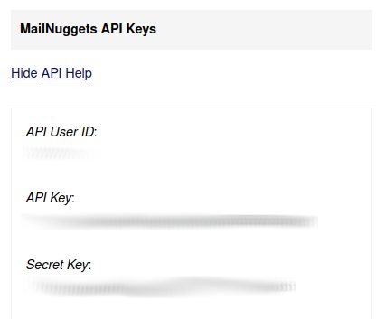

# MailNuggets Api Client
Api Client Wrapper for MailNuggets service 

## Status


### Installation
```shell
npm install mailnuggets
```

### How to use
- Get your api credentials on your [MailNuggets Profile](https://www.mailnuggets.com/usersettings)



- And configure the client with your credentials

```js
const MailNuggets = require('mailnuggets')

const MN = new MailNuggets({
    userId: 'yourUserId',
    apiKey: 'yourApiKey',
    apiSecret: 'yourApiSecret'
});

MN.listEmails()
    .then(result => {
        console.log('Result', result.emails.email[0]);
    })
    .catch(error => {
        console.error('Error', error);
    })
```